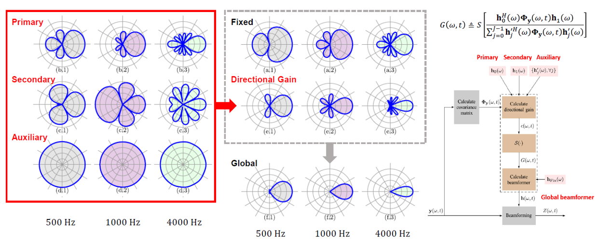

# A framework of directional-gain beamforming and a white-noise-gain-controlled solution
**Unofficial Implementation of following research paper:** 
Pan, Chao, and Jingdong Chen. "A framework of directional-gain beamforming and a white-noise-gain-controlled solution." IEEE/ACM Transactions on Audio, Speech, and Language Processing 30 (2022): 2875-2887. https://doi.org/10.1109/taslp.2022.3202127. 

**Referenced paper:** 
Zhang, Fan, et al. "Directional Gain Based Noise Covariance Matrix Estimation for MVDR Beamforming." ICASSP 2024-2024 IEEE International Conference on Acoustics, Speech and Signal Processing (ICASSP). IEEE, 2024. https://doi.org/10.1109/icassp48485.2024.10447393.

**Seminar presentation video (Korean):** 
https://sunny-archive.tistory.com/112

## Directional Gain 

  

## Beampatterns

## Acknowlegement
Special thanks to kimhs355. This work is implemented by his contribution.
